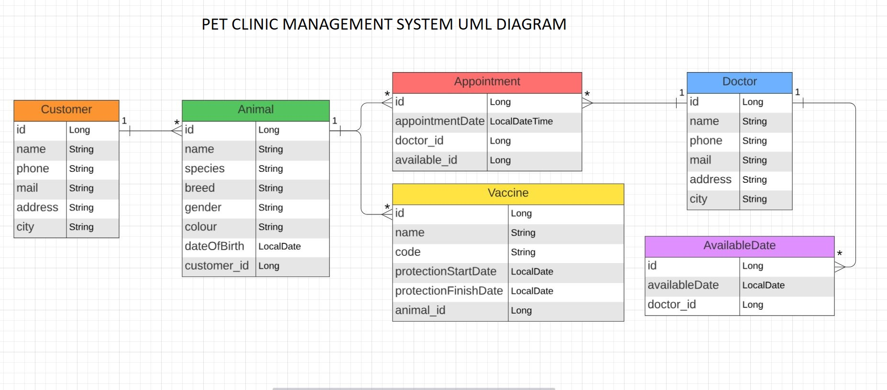

# PET CLINIC MANAGEMENT SYSTEM
This project provides a REST API for managing the operations of a veterinary clinic.
The application is designed to be used by veterinary staff.
With this application, the staff can manage veterinarians,
their working/available days, customers, their pets, vaccines applied to pets, and appointments.

#### Watch the [YouTube Video](https://youtu.be/froi-_W3QTY)

#### Dive into the [Backend Live Demo with Swagger UI](https://pet-clinic-management-system.onrender.com/swagger-ui/index.html#) (Note: Because of the free database, it's opening very slowly. But after that, it works fine.)

The project adopts a layered architecture, including the Entity, Repository, Service, and Controller layers.
Inversion of Control (IoC) and Dependency Injection (DI) are implemented using constructor injection.
Essential annotations such as @Entity, @Table, @Id, @OneToMany, @ManyToOne have been incorporated.
PostgreSQL is employed as the project's database system.

## Technologies Used
<code></code>
<code></code>
<code></code>
<code></code>
<code></code>
<code></code>
<code></code>
<code></code>
<code></code>

## UML Diagram

## API Endpoints

### Animals
| Endpoint                        | HTTP Method | Explanation                                     |
|---------------------------------|-------------|-------------------------------------------------|
| /api/v1/animals                 | GET         | List of all animals                             |
| /api/v1/animals/{id}            | GET         | Animal by id number                             |
| /api/v1/animals/customer/{name} | GET         | All animals belonging to a customer are listed. |
| /api/v1/animals/name/{name}     | GET         | Animals are listed by name.                     |
| /api/v1/animals                 | POST        | Add new animal.                                 |
| /api/v1/animals/{id}            | PUT         | Update the animal of a specific id.             |
| /api/v1/animals/{id}            | DELETE      | Delete the animal of a specific id.             |

### Appointments
| Endpoint                               | HTTP Method  | Explanation                                                                        |
|----------------------------------------|--------------|------------------------------------------------------------------------------------|
| /api/v1/appointments                   | GET          | List of all appointments.                                                          |
| /api/v1/appointments/{id}              | GET          | Appointment by id number.                                                          |
| /api/v1/appointments/animal/date-range | GET          | The appointments for a specified animal within a designated date range are listed. |
| /api/v1/appointments/doctor/date-range | GET          | The appointments for a specified doctor within a designated date range are listed. |
| /api/v1/appointments                   | POST         | Add new appointment.                                                               |
| /api/v1/appointments/{id}              | PUT          | Update the appointment of a specific id.                                           |
| /api/v1/appointments/{id}              | DELETE       | Delete the appointment of a specific id.                                           |

### AvailableDates
| Endpoint                          | HTTP Method | Explanation                                                              |
|-----------------------------------|-------------|--------------------------------------------------------------------------|
| /api/v1/available-date            | GET         | List of all available dates.                                             |
| /api/v1/available-date/{id}       | GET         | Available date by id number.                                             |
| /api/v1/available-date/date-range | GET         | The available dates of a specific doctor on a requested date are listed. |
| /api/v1/available-date            | POST        | Add new AvailableDate.                                                   |
| /api/v1/available-date/{id}       | PUT         | Update the available date of a specific id.                              |
| /api/v1/available-date/{id}       | DELETE      | Delete the available date of a specific id.                              |

### Customers
| Endpoint                      | HTTP Method | Explanation                             |
|-------------------------------|-------------|-----------------------------------------|
| /api/v1/customers             | GET         | List of all customers.                  |
| /api/v1/customers/{id}        | GET         | Customer by id number.                  |
| /api/v1/customers/name/{name} | GET         | List of customers with a specific name. |
| /api/v1/customers             | POST        | Add new Customer.                       |
| /api/v1/customers/{id}        | PUT         | Update the customer of a specific id.   |
| /api/v1/customers/{id}        | DELETE      | Delete the customer of a specific id.   |

### Doctors
| Endpoint             | HTTP Method | Explanation                          |
|----------------------|-------------|--------------------------------------|
| /api/v1/doctors      | GET         | List of all doctors.                 |
| /api/v1/doctors/{id} | GET         | Doctor by id number.                 |
| /api/v1/doctors      | POST        | Add new Doctor.                      |
| /api/v1/doctors/{id} | PUT         | Update the doctor of a specific id.  |
| /api/v1/doctors/{id} | DELETE      | Delete the doctor of a specific id.  |

### Vaccines
| Endpoint                     | HTTP Method | Explanation                                                 |
|------------------------------|-------------|-------------------------------------------------------------|
| /api/v1/vaccines             | GET         | List of all vaccines.                                       |
| /api/v1/vaccines/{id}        | GET         | Vaccine by id number.                                       |
| /api/v1/vaccines/animal/{id} | GET         | The list of vaccines for a specific animal.                 |
| /api/v1/vaccines/date-range  | GET         | The list of vaccines expiring within a specific time range. |
| /api/v1/vaccines             | POST        | Add new Vaccine.                                            |
| /api/v1/vaccines{id}         | PUT         | Update the vaccine of a specific id.                        |
| /api/v1/vaccines{id}         | DELETE      | Delete the vaccine of a specific id.                        |

## Setup and Run
1. Clone the project:
- `git clone`
2. Configure the database in this file:
- `src/main/resources/application.properties`
3. You need to update the following environment variables
- `spring.datasource.url`
- `spring.datasource.username`
- `spring.datasource.password`
3. To start the project, launch it from your IDE.
4. After running the project, to explore the API documentation,
visit the Swagger UI at: [http://localhost:8080/swagger-ui/index.html](http://localhost:8080/swagger-ui/index.html) and
use the API endpoints to perform CRUD operations.

## Contributing
If you want to contribute, please open an issue first to discuss your proposed changes.

## License
This project is licensed under the [MIT](https://choosealicense.com/licenses/mit/) License.
